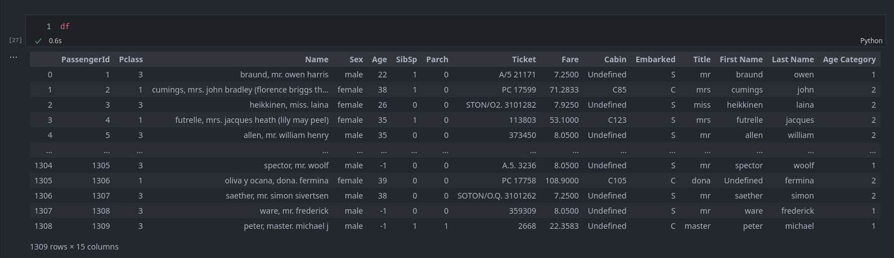

# Lab 2 - Data 2

## Steps to get to solution

1. Deal with NaN values
2. Clean age values (Change data type)
   
3. cast lowercase (for better grouping)
5. Feature engineer Title
6. Feature Engineer Last name
7. Feature Engineer First name

8. Convert Age to Ordinal data

# Final result

You are done with the lab when you dataframe looks something like this *(doesn't have to be 100% the same)*:

